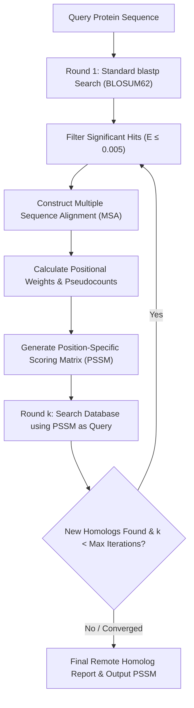

# Position-Specific Iterated BLAST (PSI-BLAST)

**Position-Specific Iterated BLAST (PSI-BLAST)** is an iterative sequence alignment methodology introduced by [[altschul-1997-gapped-blast|Altschul et al. (1997)]] that uses dynamic **Position-Specific Scoring Matrices (PSSMs)** to discover remote protein homologs in the "twilight zone" ($<25\%$ sequence identity) that are undetectable by pairwise [[NCBI-BLAST|blastp]].

---

## 🧬 Why Pairwise Alignment Fails at Low Identity

Standard pairwise alignment algorithms rely on static log-odds substitution matrices like [[Substitution-Matrices-PAM-BLOSUM|BLOSUM62]]. In BLOSUM62, mutating a Tryptophan ($W$) or Cysteine ($C$) has the exact same penalty regardless of whether that residue is located in an active catalytic triad, a hydrophobic core, or a variable solvent-exposed loop.

**PSI-BLAST solves this by learning positional tolerance:**
- Positions strictly conserved across an evolutionary family receive steep penalties for variation.
- Positions that tolerate diverse substitutions across family members are assigned flexible, position-specific scores.

---

## 🔄 The Iterative PSI-BLAST Cycle

---

## 📐 Mathematical Formulation of PSSM Construction

### 1. Sequence Weighting (Henikoff Method)
To prevent highly represented subfamilies from biasing the profile, PSI-BLAST weights each aligned sequence $s$ based on residue diversity across MSA columns:
$$w_s = \sum_{i=1}^L \frac{1}{r_i \cdot c_{i, s_i}}$$
where $r_i$ is the number of distinct residue types in column $i$, and $c_{i, s_i}$ is the count of occurrences of residue $s_i$ in column $i$.

### 2. Pseudocount Regularization
Observed weighted residue frequencies $f_{i, j}$ at query position $i$ for amino acid $j$ are smoothed using background Dirichlet pseudocounts derived from standard substitution matrices ([[Substitution-Matrices-PAM-BLOSUM|BLOSUM62]] conditional probabilities $q_{j|k}$):
$$g_{i, j} = \frac{\alpha f_{i, j} + \beta \sum_{k=1}^{20} f_{i, k} q_{j|k}}{\alpha + \beta}$$
where:
- $\alpha = N_c - 1$ ($N_c$ is the number of independent sequences).
- $\beta$ is a pseudo-count weight constant (empirically set to $\beta \approx 10$).

### 3. Log-Odds Position Score
The position-specific score $S_{i, j}$ for residue $j$ at position $i$ is calculated using the Karlin-Altschul scale parameter $\lambda$:
$$S_{i, j} = \frac{1}{\lambda} \ln \left( \frac{g_{i, j}}{q_j} \right)$$
where $q_j$ is the background database frequency of residue $j$.

---

## ⚠️ Profile Corruption & Mitigation

The primary vulnerability of iterative profile searching is **profile corruption**:
- If a non-homologous sequence (e.g., a low-complexity coil or coiled-coil domain) passes the inclusion threshold, its residues enter the MSA.
- In subsequent rounds, the PSSM becomes corrupted, pulling in thousands of spurious database sequences in an exponential false-positive cascade.

### Safeguards:
1. **Strict Inclusion Threshold**: Default $E$-value cutoff of $E \le 0.005$ or $E \le 0.001$.
2. **Composition-Based Statistics (Schäffer et al. 2001)**: Adjusts the scoring matrix dynamically based on the specific amino acid composition of the matched database subject.
3. **SEG Low-Complexity Filtering**: Filters out repetitive and biased composition regions before seed extraction.

---

## 🔗 Related Pages
- **Foundational Source**: [[altschul-1997-gapped-blast]]
- **Parent Concepts**: [[Substitution-Matrices-PAM-BLOSUM]], [[Karlin-Altschul-Statistics]], [[Seed-and-Extend-Heuristic]]
- **Entities**: [[PSI-BLAST]], [[NCBI-BLAST]], [[MMseqs2]]
- **Synthesis Overview**: [[Profile-Search-and-Remote-Homology]], [[Heuristic-Alignment-Paradigms-BLAST-DIAMOND-MMseqs2]]
