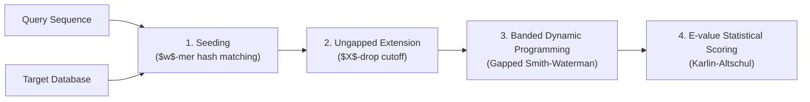

# Seed-and-Extend Heuristic Alignment

The **Seed-and-Extend** heuristic is the foundational algorithmic strategy employed by high-speed sequence aligners including [[NCBI-BLAST]], [[DIAMOND]], and [[MMseqs2]] to bypass the quadratic $O(M \cdot N)$ computational complexity of exact Smith-Waterman dynamic programming.

---

## ⚙️ Core Mechanics

### 1. Seeding ($k$-mer / $w$-mer Matching)
- **Word Length ($w$)**: Fixed short word length (e.g. $w=3$ for protein BLAST, $w=11$ for nucleotide BLAST, $k=7$ for MMseqs2).
- **Neighborhood Expansion**: For protein queries, generate all potential $w$-mers whose score with the query word using [[Substitution-Matrices-PAM-BLOSUM]] (e.g. BLOSUM62) meets a threshold $T$:
  $$\text{Score}(W_{\text{query}}, W_{\text{candidate}}) \ge T$$
- **1-Hit vs. 2-Hit Seeding**: While original [[altschul-1990-blast|BLAST 1990]] triggered extensions on any single hit, modern engines utilize the [[Two-Hit-Seed-Heuristic]] ([[altschul-1997-gapped-blast|Altschul et al. 1997]]), requiring two non-overlapping hits on the same diagonal within 40 residues, cutting extension runtime by ~90%.
- **Hit Detection**: Query words or pre-computed hash lookup tables identify exact occurrences of neighborhood words in the database in linear $O(N)$ time.

### 2. Ungapped Extension ($X$-Drop)
- When a seed match is found at query position $i$ and database position $j$, the alignment is extended bidirectionally along the diagonal $(i-j)$ without inserting gaps.
- Extension terminates when the running cumulative alignment score drops by more than $X$ below the maximal score achieved during the extension:
  $$S_{\text{current}} < S_{\text{max}} - X$$
- This identifies High-Scoring Segment Pairs (HSPs).

### 3. Gapped Extension
- If an HSP exceeds an initial score cutoff $S_g$, full dynamic programming is triggered within a restricted banded matrix around the seed diagonal.
- Modern implementations utilize SIMD-vectorized affine gap penalties ($Gap_{\text{open}} + k \cdot Gap_{\text{extend}}$).

### 4. Statistical Significance
- The resulting local alignment score $S$ is evaluated against the [[Karlin-Altschul-Statistics]] framework to yield normalized Bit Scores ($S'$) and Expectation values ($E$).

---

## 🔬 Related Pages
- [[Two-Hit-Seed-Heuristic]]
- [[Position-Specific-Iterated-BLAST]]
- [[Karlin-Altschul-Statistics]]
- [[Substitution-Matrices-PAM-BLOSUM]]
- [[Double-Indexing-and-Reduced-Alphabets]]
- [[BLAST-Alignment-Filtering]]
- [[NCBI-BLAST]]
- [[PSI-BLAST]]
- [[DIAMOND]]
- [[MMseqs2]]
- [[Heuristic-Alignment-Paradigms-BLAST-DIAMOND-MMseqs2]]
