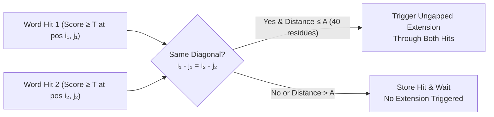

# Two-Hit Seed Heuristic

The **Two-Hit Seed Heuristic** is a major computational acceleration introduced in [[altschul-1997-gapped-blast|Gapped BLAST (1997)]] that dramatically reduces the time spent on unproductive ungapped extensions without sacrificing sequence search sensitivity.

---

## 🎯 The Motivation: The Extension Bottleneck

In original 1-hit [[altschul-1990-blast|BLAST (1990)]]:
1. The query sequence is broken into overlapping words of length $w$ (typically $w=3$ for proteins).
2. For each query word, all possible $w$-mers scoring $\ge T$ against standard substitution matrices ([[Substitution-Matrices-PAM-BLOSUM|BLOSUM62]]) are indexed into a DFA or lookup table.
3. Every exact match in the database to one of these neighborhood words immediately triggers an ungapped **$X$-drop extension**.
4. In practice, **$>90\%$ of BLAST execution time** was spent extending random, isolated 1-hit matches that failed to achieve statistical significance.

---

## ⚙️ The Two-Hit Seeding Mechanism

The two-hit heuristic operates on a fundamental observation: **biologically meaningful alignments almost always contain multiple matching words along the same diagonal in close proximity.**

### Operational Rules:
1. **Lower Threshold $T$**: The hit threshold is lowered from $T=13$ (1-hit) to $T=11$ (2-hit). While a single $T=11$ match is less specific, requiring **two** independent matches provides higher joint specificity.
2. **Same Diagonal Constraint**: Both hits must lie on the exact same diagonal $D = i - j$:
   $$i_1 - j_1 = i_2 - j_2$$
3. **Proximity Window ($A$)**: The second hit must occur within a window of $A = 40$ residues from the first hit without overlapping:
   $$0 < i_2 - i_1 \le 40$$
4. **Extension Execution**: When the second hit is registered, BLAST extends the alignment bidirectionally through both seed hits until the score drops by $X_u$ below the maximum score yet attained.

---

## 📊 Comparative Performance

| Seeding Scheme | Protein Word Length ($w$) | Score Threshold ($T$) | Extension Trigger Condition | Speed Relative to BLAST 1990 | Sensitivity Level |
| :--- | :--- | :--- | :--- | :--- | :--- |
| **1-Hit (BLAST 1990)** | 3 | 13 | Single word match | $1.0\times$ (Baseline) | Standard |
| **2-Hit (BLAST 1997)** | 3 | 11 | 2 non-overlapping hits on diagonal within 40 res | $\mathbf{3.0\times}$ | Higher (catches lower-scoring seeds) |
| **Spaced Seeds ([[DIAMOND]])** | 4–6 | Spaced mask | Pattern matches across double index | $\mathbf{500\times - 10,000\times}$ | High to Ultra-Sensitive |
| **Cascaded Filter ([[MMseqs2]])** | 6–7 | Reduced Alphabet | Consecutive $k$-mer matches on diagonal | $\mathbf{1,000\times - 36,000\times}$ | Tunable Cascades |

---

## 🔗 Related Pages
- **Foundational Source**: [[altschul-1997-gapped-blast]]
- **Parent Concept**: [[Seed-and-Extend-Heuristic]]
- **Related Algorithms**: [[Double-Indexing-and-Reduced-Alphabets]], [[Position-Specific-Iterated-BLAST]]
- **Implementations**: [[NCBI-BLAST]], [[PSI-BLAST]], [[DIAMOND]], [[MMseqs2]]
- **Synthesis Guide**: [[Heuristic-Alignment-Paradigms-BLAST-DIAMOND-MMseqs2]]
