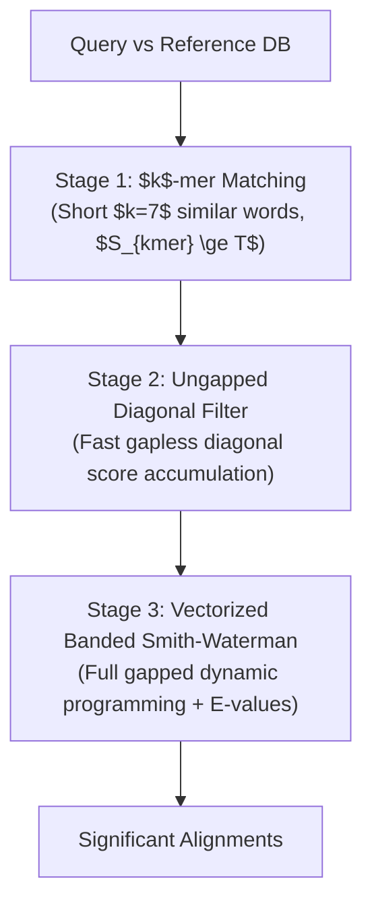

# Steinegger & Söding (2017) — MMseqs2 Suite

## Citation
- **Authors**: Martin Steinegger, Johannes Söding
- **Publication**: *Nature Biotechnology*, 35(11):1026–1028, 2017
- **DOI**: [10.1038/nbt.3988](https://doi.org/10.1038/nbt.3988)
- **Primary Source**: [`raw/steinegger2017_mmseqs2.md`](file:///c:/Users/User/Documents/GitHub/Mystery-Sequence-Identifier-and-BLAST-Automation/raw/steinegger2017_mmseqs2.md)

---

## Executive Summary
MMseqs2 (Many-against-Many sequence searching) is a modular software framework for ultra-fast sequence searching, clustering, and taxonomic assignment across terabase-scale genomic and metagenomic datasets. It matches the sensitivity of BLAST/PSI-BLAST while operating 100x to 10,000x faster.

---

## Key Methodological Innovations

### 1. 3-Stage Cascaded Search Architecture

### 2. Spaced & Consecutive $k$-mer Indexing
- Uses short $k$-mers ($k=7$) over a 21-letter amino acid alphabet (or reduced alphabet for low-sensitivity modes).
- Generates pre-indexed similar $k$-mer lists using BLOSUM62 score cutoffs.
- Requires two consecutive matching seeds on the same diagonal to trigger ungapped extension.

### 3. SSE2/AVX2 Vectorized Dynamic Programming
- Vectorized banded Smith-Waterman implementation computes scores parallelized over processor registers.
- Calculates rigorous [[Karlin-Altschul-Statistics]] scores, $E$-values, and coverage metrics.

---

## Connections to Knowledge Graph
- **Concepts**: [[Seed-and-Extend-Heuristic]], [[Double-Indexing-and-Reduced-Alphabets]], [[Karlin-Altschul-Statistics]], [[Substitution-Matrices-PAM-BLOSUM]]
- **Entities**: [[MMseqs2]], [[DIAMOND]], [[NCBI-BLAST]], [[Biopython]]
- **Synthesis**: [[Heuristic-Alignment-Paradigms-BLAST-DIAMOND-MMseqs2]], [[Remote-vs-Local-BLAST]]
