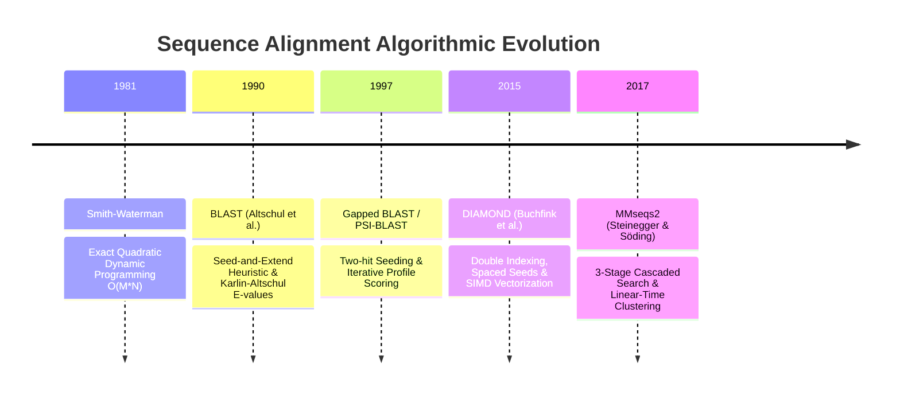
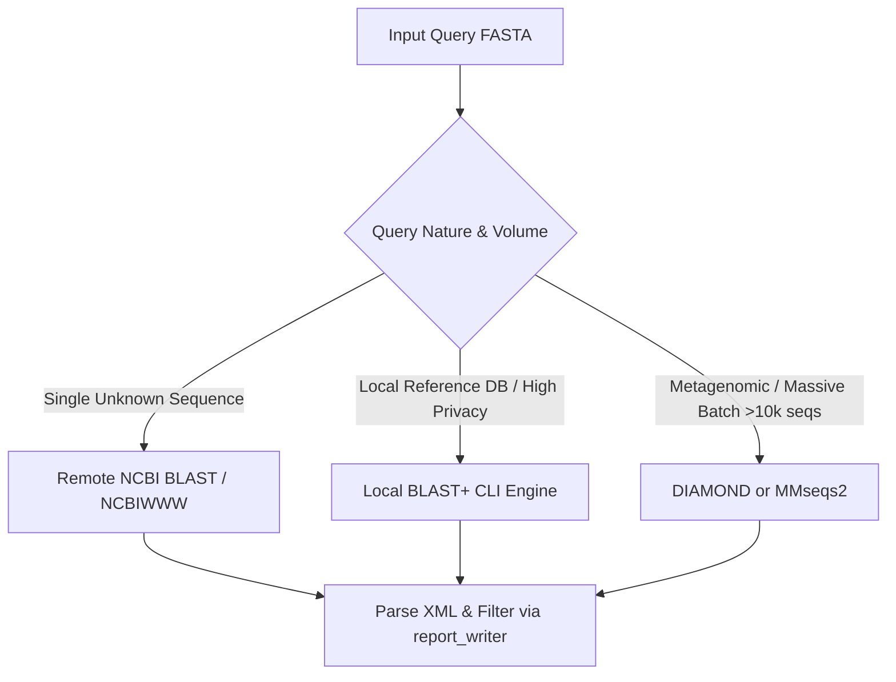

# Heuristic Alignment Paradigms: BLAST, DIAMOND, and MMseqs2

Pairwise sequence alignment is the fundamental computational primitive of computational genomics and bioinformatics. Over four decades, the field has evolved from exhaustive dynamic programming to ultra-fast vectorized seed-and-extend heuristics capable of searching petabase-scale sequence archives.

---

## 🏛️ 1. Evolutionary Timeline of Alignment Paradigms

---

## 🔬 2. Deep Technical Comparison

| Feature | [[NCBI-BLAST]] (BLAST+) | [[DIAMOND]] | [[MMseqs2]] |
| :--- | :--- | :--- | :--- |
| **Primary Domain** | Nucleotide & Protein general search | High-throughput protein & translated DNA | Terabase-scale protein/nucleotide & clustering |
| **Seeding Mechanism** | Fixed $w$-mers ($w=3$ protein, $w=11$ DNA) + neighborhood $T$ | Spaced seeds (`110100111`, length 15–24) | Consecutive / spaced $k$-mers ($k=7$) + 2-hit diagonal |
| **Alphabet Compression** | Full 20 amino acids | Reduced 10–11 letter alphabet bins | Reduced 21-letter or 11-letter alphabet |
| **Memory Architecture** | Single-sided query/DB hash indexing | **Double indexing** (bilateral sorted tuple merge) | In-memory pre-computed index tables |
| **Extension Engine** | Ungapped $X$-drop $\rightarrow$ scalar Banded DP | SIMD-vectorized Banded Smith-Waterman (AVX2/512) | 2-stage ungapped filter $\rightarrow$ SIMD Banded DP |
| **Relative Speedup** | $1\times$ (Baseline) | $500\times - 20,000\times$ | $1,000\times - 10,000\times$ |
| **Sensitivity** | Golden standard ($100\%$) | $85\% - 99\%$ (tunable via `--ultra-sensitive`) | $90\% - 99\%$ (tunable via `-s`) |
| **Statistical Model** | [[Karlin-Altschul-Statistics]] ($E$-value, bit score) | [[Karlin-Altschul-Statistics]] | [[Karlin-Altschul-Statistics]] |

---

## ⚙️ 3. Algorithmic Deep Dives

### A. Classical BLAST Seeding vs. Modern Spaced Seeds
- **BLAST**: Requires contiguous exact or high-scoring word matches. In divergent sequences (e.g. twilight zone homology at 20–35% sequence identity), contiguous matches frequently fail to occur.
- **DIAMOND Spaced Seeds**: By using masks such as `110100111` (where `1` requires a match and `0` ignores the position), the seed spans a wider window, tolerating conservative point mutations and loop flexibility.

### B. Single Indexing vs. Double Indexing
- In standard BLAST+, scanning a 100 GB database against millions of short reads generates billions of cache misses as CPU registers look up disparate hash buckets.
- In **Double Indexing** ([[Double-Indexing-and-Reduced-Alphabets]]), query seeds and database seeds are bucketed and sorted into contiguous memory buffers. A simple linear pointer scan identifies all seed overlaps directly inside CPU L2/L3 cache lines.

### C. Cascaded Filtering
- **MMseqs2** achieves extreme throughput by enforcing strict rejection gates:
  1. Fast integer seed matching filters $\approx 90\%$ of non-matching sequences.
  2. Ungapped diagonal accumulation rejects another $\approx 9.9\%$.
  3. Only the surviving $\approx 0.1\%$ candidate pairs undergo costly vectorized gapped dynamic programming.

---

## 💡 4. Architectural Recommendations for this Pipeline

1. **Ad-hoc Mystery Sequence Analysis**:
   - For 1–10 mystery sequences, remote NCBI QBLAST (via [`blast_engine.py`](file:///c:/Users/User/Documents/GitHub/Mystery-Sequence-Identifier-and-BLAST-Automation/blast_engine.py)) avoids local multi-terabyte database downloads.
2. **Dedicated Workstations & Pipelines**:
   - For local high-throughput tasks, standalone NCBI BLAST+ CLI with local `nt`/`nr` indices provides multi-threaded execution.
3. **High-Volume Metagenomics**:
   - For millions of reads, integrating DIAMOND or MMseqs2 as backend aligners provides a 3-4 order of magnitude reduction in runtime.

---

## 🔗 Related Pages
- [[altschul-1990-blast]]
- [[buchfink-2021-diamond]]
- [[steinegger-2017-mmseqs2]]
- [[Seed-and-Extend-Heuristic]]
- [[Double-Indexing-and-Reduced-Alphabets]]
- [[Karlin-Altschul-Statistics]]
- [[Substitution-Matrices-PAM-BLOSUM]]
- [[Remote-vs-Local-BLAST]]
- [[Local-BLAST-Installation-and-Indexing]]
- [[Pipeline-Architecture]]
