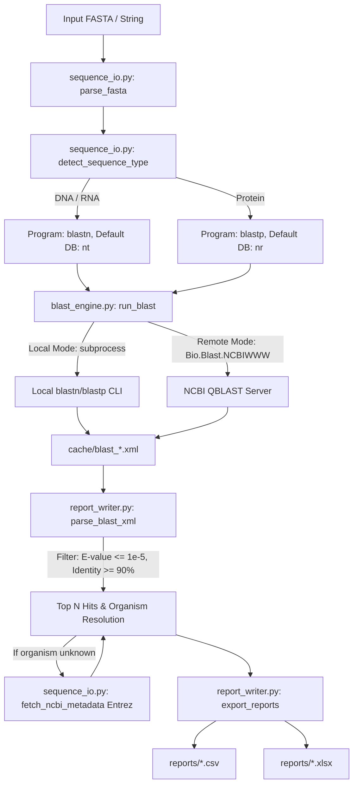

# Pipeline Architecture & Dataflow

## Overview
The **Mystery Sequence Identifier** pipeline automates the end-to-end identification of unknown biological sequences from input FASTA files to final statistical summary reports with support for both local high-performance standalone BLAST+ CLI and remote NCBI WWW API execution.

---

## Component Breakdown

| Module | Core Responsibility | Key Technologies |
| :--- | :--- | :--- |
| [`sequence_io.py`](file:///c:/Users/User/Documents/GitHub/Mystery-Sequence-Identifier-and-BLAST-Automation/sequence_io.py) | [[FASTA-Format]] ingestion, [[Sequence-Type-Inference]], [[NCBI-Entrez]] metadata retrieval | `Bio.SeqIO`, `Bio.Entrez` |
| [`blast_engine.py`](file:///c:/Users/User/Documents/GitHub/Mystery-Sequence-Identifier-and-BLAST-Automation/blast_engine.py) | Dual local/remote execution, CLI subprocess bridge, retry backoff, XML caching | `subprocess`, `Bio.Blast.NCBIWWW` |
| [`report_writer.py`](file:///c:/Users/User/Documents/GitHub/Mystery-Sequence-Identifier-and-BLAST-Automation/report_writer.py) | XML parsing, [[BLAST-Alignment-Filtering]], CSV/Excel export | `Bio.Blast.NCBIXML`, `pandas`, `openpyxl` |
| [`main.py`](file:///c:/Users/User/Documents/GitHub/Mystery-Sequence-Identifier-and-BLAST-Automation/main.py) | CLI argument orchestration (`--mode`, `--db`, `--threads`) | `argparse` |
| [`download_data.py`](file:///c:/Users/User/Documents/GitHub/Mystery-Sequence-Identifier-and-BLAST-Automation/download_data.py) | Test dataset retrieval from NCBI & RCSB PDB | `urllib`, `Bio.Entrez` |
| [`test_pipeline.py`](file:///c:/Users/User/Documents/GitHub/Mystery-Sequence-Identifier-and-BLAST-Automation/test_pipeline.py) | Automated test suite for inference, filtering, and exports | `unittest` |

---

## Caching Strategy
Alignment executions against remote NCBI servers or large local databases are disk-cached via deterministic XML filenames:
`cache/blast_<safe_sequence_id>.xml`

Subsequent runs on the same sequence bypass query execution unless `--force-reblast` (`-f`) is specified.

---

## Cross-References
- [[codebase-blast-pipeline]]
- [[NCBI-BLAST]]
- [[NCBI-Entrez]]
- [[NCBI-Taxonomy-Resolution]]
- [[Biopython]]
- [[Sequence-Type-Inference]]
- [[BLAST-Alignment-Filtering]]
- [[Substitution-Matrices-PAM-BLOSUM]]
- [[Karlin-Altschul-Statistics]]
- [[Seed-and-Extend-Heuristic]]
- [[Double-Indexing-and-Reduced-Alphabets]]
- [[Remote-vs-Local-BLAST]]
- [[Local-BLAST-Installation-and-Indexing]]
- [[Heuristic-Alignment-Paradigms-BLAST-DIAMOND-MMseqs2]]
- [[FASTA-Format]]
