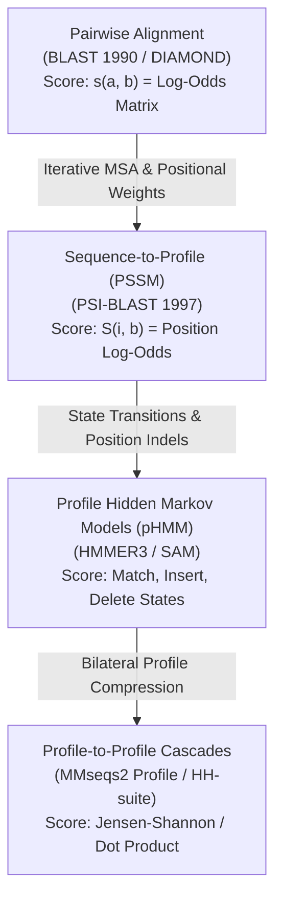

# Profile Search and Remote Homology in the Twilight Zone

The **"Twilight Zone"** of sequence alignment refers to the region between **$10\%$ and $25\%$ pairwise sequence identity**, where standard pairwise alignment methods ([[NCBI-BLAST|blastp]], [[DIAMOND]]) fail to distinguish true evolutionary homologs from random sequence noise. 

This synthesis investigates how the transition from pairwise static scoring matrices to **Position-Specific Scoring Matrices (PSSMs)**, **Profile Hidden Markov Models (HMMs)**, and **Cascaded Profile-Profile searches** revolutionized remote homology detection.

---

## 🌌 1. The Twilight Zone Problem

```
Pairwise Sequence Identity Range:
100% ===================================> 35% : Daylight Zone (Pairwise BLAST / DIAMOND 100% Reliable)
 35% =========================> 25%          : Midnight / Threshold Zone (Pairwise alignment loses sensitivity)
 25% ============> 10%                       : TWILIGHT ZONE (Requires Profile / PSSM / HMM methods)
 10% ====> 0%                                : Structural / Dark Matter Zone (Requires 3D Foldseek / AlphaFold)
```

In the twilight zone:
- Two proteins may share identical 3D tertiary folds and catalytic mechanisms despite having accumulated mutations at $\ge 80\%$ of their sequence positions.
- Static substitution matrices ([[Substitution-Matrices-PAM-BLOSUM|BLOSUM62]]) penalize every divergence uniformly, causing the cumulative Karlin-Altschul alignment score $S$ to fall below the database significance threshold ($E > 10$).

---

## 🧬 2. Architectural Evolution of Profile Alignment



---

## 📊 3. Comparative Methodology Matrix

| Search Paradigm | Key Implementations | Query Representation | Target Representation | Sensitivity in Twilight Zone | Computational Cost |
| :--- | :--- | :--- | :--- | :--- | :--- |
| **Sequence-to-Sequence (Pairwise)** | [[NCBI-BLAST]] `blastp`, [[DIAMOND]] | Single sequence string | Database sequence string | $\approx 20\% - 30\%$ | $1\times$ (Fastest) |
| **Sequence-to-Profile (PSSM)** | [[PSI-BLAST]] | $L \times 20$ Log-odds PSSM matrix | Database sequence string | $\approx 65\% - 75\%$ | $3\times - 10\times$ |
| **Profile HMM** | `HMMER3` (`phmmer`, `hmmsearch`) | Hidden Markov Model with state transitions ($M_k, I_k, D_k$) | Database sequence string | $\approx 80\% - 85\%$ | $10\times - 50\times$ |
| **Profile-to-Profile** | `HHblits` (HH-suite), [[MMseqs2]] (`mmseqs search -s 7`) | Profile / pHMM | Pre-computed profile database | $\approx 90\% - 95\%$ | $5\times - 30\times$ (MMseqs2 SIMD) |

---

## 📐 4. Mathematical Comparison: How Scoring Changes

### 1. Pairwise Static Scoring (BLAST 1990)
$$S_{\text{pair}} = \sum_{k=1}^N s(q_k, t_k) - \text{Gap Penalties}$$
where $s(a,b)$ is a fixed scalar look-up from BLOSUM62.

### 2. Position-Specific Log-Odds Scoring (PSI-BLAST 1997)
$$\text{Score}(\text{Query Profile}, T) = \sum_{k=1}^N S_{k, t_k} - \text{Gap Penalties}$$
where $S_{k, t_k} = \frac{1}{\lambda} \ln \left( \frac{g_{k, t_k}}{q_{t_k}} \right)$, encoding exact positional conservation, Henikoff sequence weights, and Dirichlet pseudocount mixtures.

### 3. Profile-to-Profile Alignment (MMseqs2 / HH-suite)
Aligning two profiles $P$ and $Q$ compares the probability distribution over all 20 amino acids at column $i$ and column $j$:
$$S_{\text{prof-prof}}(i, j) = \sum_{a=1}^{20} P_{i}(a) \cdot Q_{j}(a) \cdot \ln \left( \frac{P_{i}(a)}{q_a} \right)$$
or through symmetric log-odds dot products, providing an exponential increase in signal-to-noise ratio.

---

## ⚠️ 5. Practical Risks: Profile Corruption vs. Cascaded Speed

1. **Profile Corruption Hazard**:
   - In [[Position-Specific-Iterated-BLAST|PSI-BLAST]], false positive inclusion ($E \le 0.005$) corrupts the PSSM, leading to runaway divergence in subsequent rounds.
   - *Mitigation*: Enable conditioned composition-based score adjustment (`-comp_based_stats 2`) and filter low-complexity regions (`SEG`).
2. **Database Pre-computation**:
   - Modern profile-to-profile systems ([[MMseqs2]]) pre-compute clustered profile databases (e.g. Uniclust30, ColabFoldDB), enabling instant multi-stage cascaded profile filtering without running multi-pass iterations on the fly.

---

## 🔗 Related Pages
- **Foundational Sources**: [[altschul-1990-blast]], [[altschul-1997-gapped-blast]], [[buchfink-2021-diamond]], [[steinegger-2017-mmseqs2]]
- **Underlying Concepts**: [[Position-Specific-Iterated-BLAST]], [[Two-Hit-Seed-Heuristic]], [[Substitution-Matrices-PAM-BLOSUM]], [[Karlin-Altschul-Statistics]], [[Seed-and-Extend-Heuristic]], [[Double-Indexing-and-Reduced-Alphabets]]
- **Entities**: [[PSI-BLAST]], [[NCBI-BLAST]], [[MMseqs2]], [[DIAMOND]], [[Biopython]]
- **Synthesis Guides**: [[Heuristic-Alignment-Paradigms-BLAST-DIAMOND-MMseqs2]], [[Pipeline-Architecture]], [[Remote-vs-Local-BLAST]]
